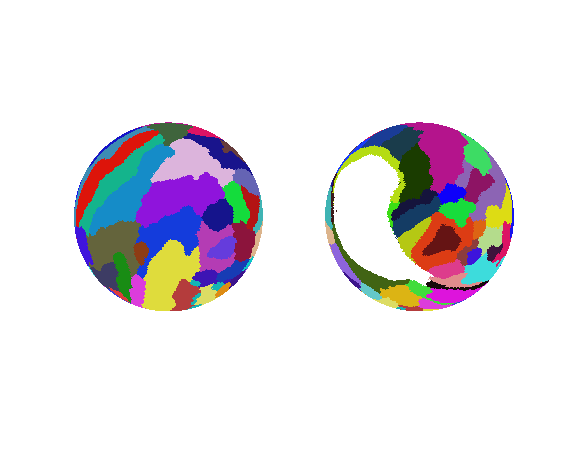
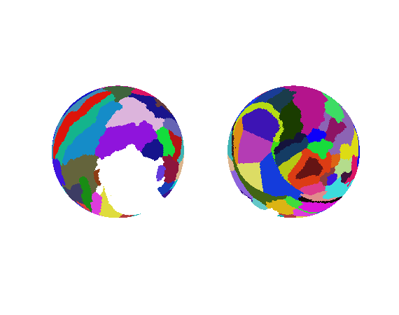

brainRot-nullModel
==============================

A method to get null parcellations on the FreeSurfer surface. This is achieved by projecting the parcellation to a sphere, and randomly rotating in the sphere space. Additionally, the 'black hole' created by the corpus callosum and subcortical structures (which we made white in the pictures below for easier viewing) is filled with labels that were rotated into the actual 'black hole' area1. 

The spherical rotation is adapted from Salim Arslan's [parcel evaluation](https://github.com/sarslancs/parcellation-survey-eval) code. A related project is the [spin-test](https://github.com/spin-test/spin-test) repo. 

### What does this code do?

Heres a look at the [Destrieux](https://surfer.nmr.mgh.harvard.edu/fswiki/CorticalParcellation) atlas projected to a sphere, in the un-rotated space:

This sphere is then rotated randomly in the x, y, and z direction:

However, after this rotation, we have moved the medial wall (i.e. thie white space) away from its original position (in grey here)... we need to make this original area black again, and we need to fill the area that used to be this black hole. 

And finally we put the original 'white space' back and fill the rotated 'white space' with labels rotated too far into the original invalid space:

### About filling the rotated back hole
1 Deciding which labels to use to fill the rotated black hole is tricky business. Does any label that touches the orignal area get _popped_ and transfered to a new area? Here, we calculated the percentage of contact with the 'black hole' that each label makes. Then, beginning with the label that overlaps most with the invalid area, we calculate how moving that label to the new space would affect the distribution of label sizes (across whole parcellation). We pick the number of labels to move based on the new parcellation that best perserves (i.e. least distant from) the original distribution of label sizes.

 This material is based upon work supported by the National Science Foundation Graduate Research Fellowship under Grant No. 1342962. Any opinion, findings, and conclusions or recommendations expressed in this material are those of the authors(s) and do not necessarily reflect the views of the National Science Foundation. 
